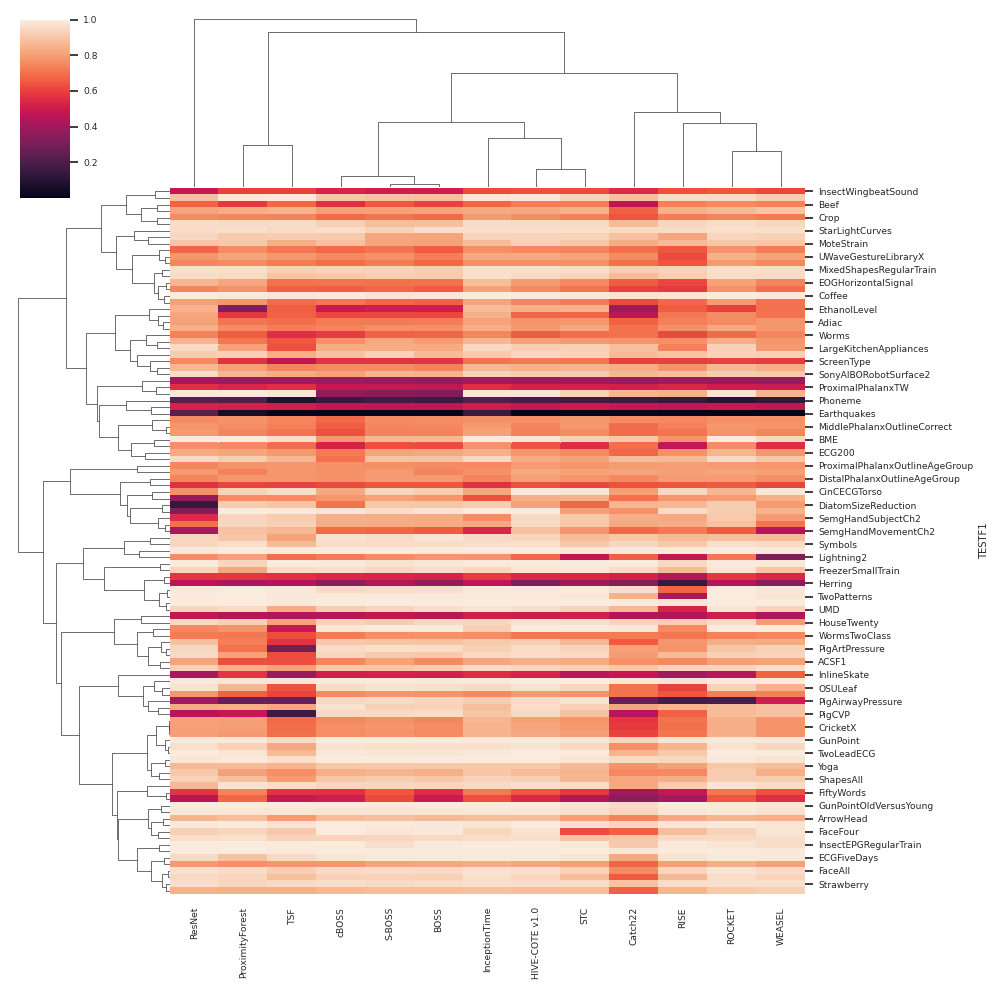

# Meta Learning on Complex Data Types

Meta-learning generalizes the empirical experience with different learning tasks and holds promise 
for providing important empirical insight into the behaviour of machine learning algorithms.

While being vastly explored for single target problems, where the target is commonly of simple type (e.g., single numeric value in regression, or single class in classification), the
work on meta-learning for complex data types (e.g., time series or multi-vector outputs) is not that rich. This project, therefore, aims to investigate 
different aspects of meta-learning for complex data types. 

Defined as learning over a learning problem, the meta-learning studies are generally expensive. To that end for this project, I considered
data from pre-existing studies: 

1. For multi-label classification: *Comprehensive comparative study of multi-label classification methods*, **Bogatinovski et al.**, 2022. https://www.sciencedirect.com/science/article/pii/S0957417422005991
2. For time-sereis classification: *The Great Time Series Classification Bake Off: An Experimental Evaluation of Recently Proposed Algorithms*, **Bagnall et al.**, 2016, https://arxiv.org/abs/1602.01711

These studies are rich enough to conduct various meta-learning problems that lead to several interesting conclusions reported in the following papers published in respectable journals: 

* *Explaining the performance of multilabel classification methods with data set properties*, **Bogatinovski J., et al.**, 2022, International Journal of Intelligent Systems, **(IF 8.993, h-index 63)** https://onlinelibrary.wiley.com/journal/1098111x
* *Less is more: Selecting the right benchmarking set of data for time series classification*, **Eftimov T., Bogatinovski J., et al.**, 2022, International Journal of Intelligent Systems, **(IF 8.665, h-index 132)** https://www.sciencedirect.com/science/article/pii/S0957417422005991

My further ideas on meta learning for multi-target regression are described in http://ipssc.mps.si/2018/Proceedings/Proceedings_2018.pdf (page 32). 

For any information, please do contact me: jasmin $.$ bogatinovski $at$  gmail $.$ com.